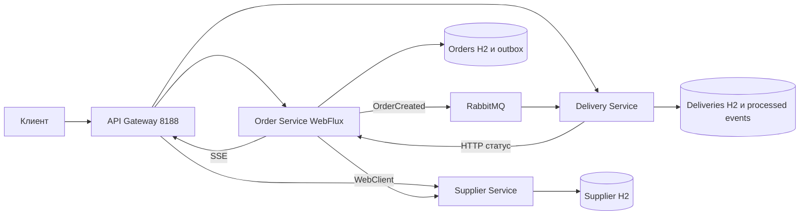
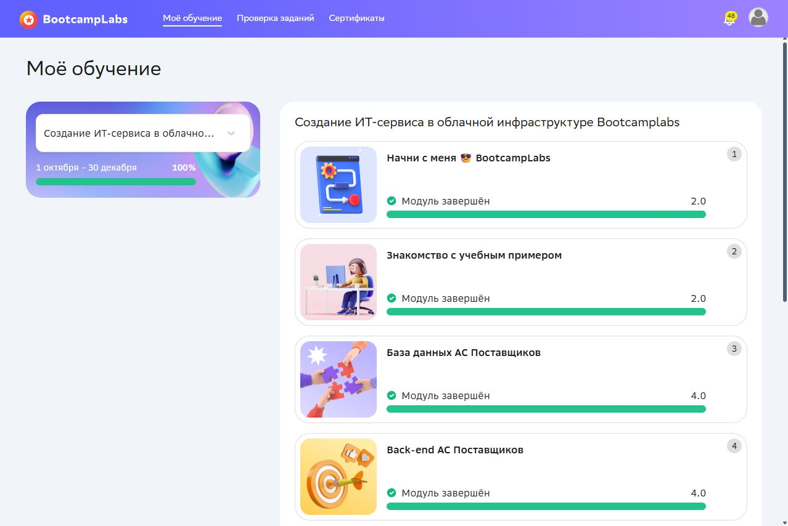

# Проектирование и разработка клиент серверных приложений

**Кашпирев Михаил Дмитриевич · ИКБО-11-23**

Практические работы №2–8 по предметной области поставщиков, заказов и доставки. Курс — «Создание ИТ сервиса в облачной инфраструктуре BootcampLabs». Проверки запусков выполнены 4 октября 2026 года.

Структура и оформление DOCX ориентированы на [Relax1205/PiRKSP_2](https://github.com/Relax1205/PiRKSP_2). Программные реализации и данные подготовлены отдельно.

## Работы и отчёты

| № | Тема и исходники | Отчёт Word | Состояние |
|---|---|---|---|
| 2 | [Java NIO и WatchService](practice-02-nio/README.md) | [DOCX](Отчёты/Практика_02_Кашпирев_МД.docx) | Запуск и скриншоты проверены |
| 3 | [Реактивная обработка RxJava](practice-03-rxjava/README.md) | [DOCX](Отчёты/Практика_03_Кашпирев_МД.docx) | Запуск и скриншоты проверены |
| 4 | [Четыре модели RSocket](practice-04-rsocket/README.md) | [DOCX](Отчёты/Практика_04_Кашпирев_МД.docx) | Запуск и скриншоты проверены |
| 5 | [Docker Compose и Traefik](practice-05-compose/README.md) | [DOCX](Отчёты/Практика_05_Кашпирев_МД.docx) | Запуск и скриншоты проверены |
| 6 | [Solidity и реестр доставки](practice-06-solidity/README.md) | [DOCX](Отчёты/Практика_06_Кашпирев_МД.docx) | Компиляция и транзакции Remix VM проверены |
| 7 | [HTTP и SSE на WebFlux](practice-07-webflux/README.md) | [DOCX](Отчёты/Практика_07_Кашпирев_МД.docx) | Запуск и скриншоты проверены |
| 8 | [Микросервисы и RabbitMQ](practice-08-microservices/README.md) | [DOCX](Отчёты/Практика_08_Кашпирев_МД.docx) | Запуск и скриншоты проверены |

## Что приложено

В каждой папке работы находятся исходники, README, команды запуска, фактические логи и оригинальные скриншоты. Для всех семи работ приложен отчёт Word. Общая папка `Отчёты` содержит все готовые DOCX. `Задания.txt` — исходные условия.

Отчёты оформлены по образцу: A4, Times New Roman 14, интервал 1,5, поля слева 3 см, справа 1,5 см, сверху и снизу 2 см; титульный лист МИРЭА, оглавление, нумерация страниц и подписанные рисунки. ФИО и группа указаны выше. Поля преподавателя, подписи и даты представления оставлены для заполнения.

Снимки Bootcamp получены из личного курса. Снимки результатов программ сделаны в окне просмотра сохранённых фактических логов; полные исходные логи приложены.

## Запуск

№2 и №3 требуют Java 21; `run.ps1` использует приложенные готовые классы и зависимости. Для №2 запустите `./run.ps1 --demo`; для №3 — `./run.ps1`. Пересборка: `./run.ps1 -Rebuild`, нужен Maven 3.9.

Для №4, 5, 7 и 8 нужен Docker Desktop. Готовые `target/app.jar` или классы с зависимостями включены, поэтому основные Dockerfile используют их. Исходные Maven-проекты и варианты полной сборки `Dockerfile.source` также приложены.

Из соответствующей папки практики:

```powershell
# №4
docker compose up --build --abort-on-container-exit --exit-code-from rsocket-demo
# №5
docker compose up -d --build --scale orders=2 --wait
./demo.ps1
# №7 или №8
docker compose up -d --build --wait
./demo.ps1
```

Внешние порты: №5 — 8155, №7 — 8177, №8 — 8188. У каждой практики своё имя Compose проекта и отдельные данные.

## Архивы

ZIP со всеми материалами и отдельные ZIP практик опубликованы в [Releases](https://github.com/MikhailBOBR/PiRKSP_2_Kashpirev/releases).

## Итоговая система №8



Проверены создание заказа через Gateway, получение товара через WebClient, событие RabbitMQ, доставка и SSE, единый requestId, повторное событие и остановка/восстановление Supplier. Publisher confirms не реализованы: это ограничение учебной реализации outbox.

## BootcampLabs



Все семь практик №2–8 завершены: исходники, DOCX, фактические результаты и скриншоты приложены. №6 проверена в Remix VM; её снимки сделаны непосредственно в интерфейсе Remix.
