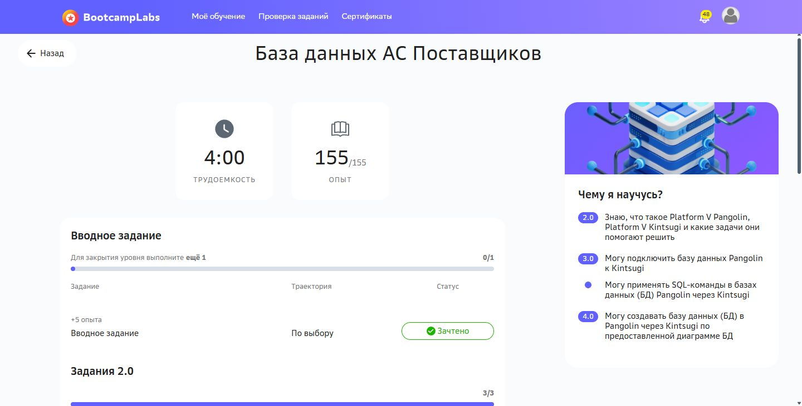

# Практическая работа №2

Java NIO и обмен файлами поставщиков

Кашпирев Михаил Дмитриевич

Группа ИКБО-11-23

Связь с курсом: **База данных АС Поставщиков**.


## Реализация

CSV использует UTF-8 и разделитель `;`. Поля: supplierId, supplierName, product, price, quantity. В `samples` три файла; поставщики Sever, Volna и Vector, товары SSD, монитор, ноутбук и периферия. Для денежных расчётов используется BigDecimal.

| Требование | Реализация |
|---|---|
| Проверка и создание каталога | Path, Files.exists, Files.createDirectories |
| Имя, размер, время изменения | inspect, Files.list, Files.size, Files.getLastModifiedTime |
| Поиск входных файлов | Проверка расширения .csv без учёта регистра |
| Чтение NIO | Первый CSV через FileChannel и ByteBuffer; остальные Files.readAllLines |
| Обработка | Проверка полей; исключение нулевого остатка; сумма price × quantity по поставщику |
| Контрольная сумма | Потоковое SHA-256; HexFormat |
| Архивация | Files.move в processed; уникальное имя при повторном запуске |
| Наблюдение | WatchService, ENTRY_CREATE и ENTRY_MODIFY, обработка OVERFLOW |
| Некорректные CSV | Отдельный каталог rejected с причиной ошибки |

```powershell
.\run.ps1 --demo
.\run.ps1 --seed --once
.\run.ps1 --seed
```

Режим `--demo` обрабатывает три образца, через 2 секунды добавляет четвёртый CSV и завершает наблюдение через 7 секунд. Без `--demo` WatchService работает до Ctrl+C.

Сценарий: incoming → обнаружение → чтение → валидация → агрегация → SHA-256 → processed. Демо публикует файл атомарным перемещением из `.part`; для внешнего копирования предусмотрено ожидание стабильного размера. Для большого медленного копирования надёжнее тоже использовать `.part` и переименование после окончания записи.

Проверка выполнена: сумма Sever = 63200.00, Volna = 116400.00, Vector = 265000.00; новый файл Orion даёт 24500.00. Полный фактический вывод находится в `run.log`. SHA-256 можно сверить командой `Get-FileHash data/processed/supply-01.csv -Algorithm SHA256`.


## BootcampLabs



Обязательные задания соответствующего модуля зачтены; общий прогресс курса 100%. Необязательные вводные задания на странице модуля могут оставаться «Не начато».

## Проверка и повторный запуск

Запуск выполнен успешно; полный фактический вывод сохранён в `run.log`. `screenshots` содержит снимки просмотра этого вывода и личного BootcampLabs.

Поставленные классы позволяют запускать `run.ps1` без Maven; нужен Java 21. Для повторной сборки: `run.ps1 -Rebuild`. На этом ноутбуке скрипт также обнаруживает установленный JDK в C:/JDK21.
