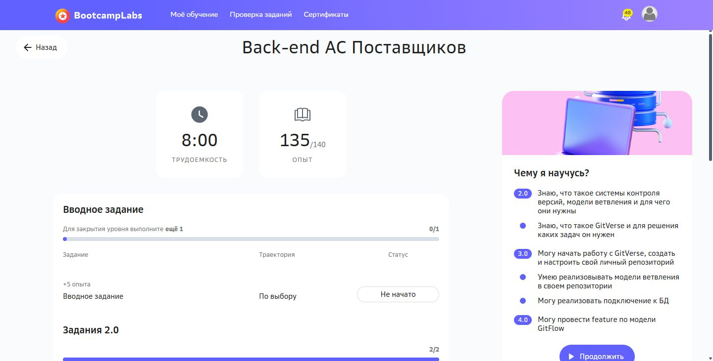

# Практическая работа №3

Реактивная обработка поставок RxJava 3

Кашпирев Михаил Дмитриевич

Группа ИКБО-11-23

Связь с курсом: **Back-end АС Поставщиков**.


## Реализация

Модель Supply содержит идентификатор и название поставщика, товар, цену BigDecimal и количество. Valued — результат расчёта стоимости доступной позиции. Некорректная позиция BAD имеет отрицательную цену; Router имеет нулевой остаток.

Observable.fromIterable → subscribeOn(io) → observeOn(computation) → flatMap(validate) → filter → map → groupBy → reduce → toList.

Валидация и `onErrorResumeNext` находятся внутри потока одной записи: ошибка BAD не прерывает обработку следующего поставщика. Суммы по поставщикам получены groupBy + reduce. Имена потоков выводятся в каждой строке.

Живой поток использует Observable.interval: новая запись каждые 180 ms автоматически проходит ту же функцию validate. buffer(3) создаёт окна для промежуточной агрегации.

Дополнительная демонстрация Flowable: источник отдаёт 500 событий с интервалом 1 ms, обработчик тратит 12 ms на событие. `onBackpressureLatest` сохраняет последнее значение при отставании; `observeOn(..., false, 8)` ограничивает очередь. Итог выводит produced, received и superseded; число полученных событий зависит от планирования потоков.

```powershell
.\run.ps1
```

Фактический прогон завершён без необработанной ошибки. В `run.log` видны SOURCE, VALUED, RECOVERED, SUMMARY, ARRIVAL, WINDOW, FAST SOURCE и SLOW CONSUMER. Пример наблюдаемого результата backpressure: produced=500, received=45, superseded=455.

Блокирующие терминальные операции применены только в консольной точке входа, чтобы дождаться завершения демонстрации. HTTP-обработчиков в этой работе нет.

Документация: https://github.com/ReactiveX/RxJava/wiki/What's-different-in-3.0


## BootcampLabs



Обязательные задания соответствующего модуля зачтены; общий прогресс курса 100%. Необязательные вводные задания на странице модуля могут оставаться «Не начато».

## Проверка и повторный запуск

Запуск выполнен успешно; полный фактический вывод сохранён в `run.log`. `screenshots` содержит снимки просмотра этого вывода и личного BootcampLabs.

Поставленные классы позволяют запускать `run.ps1` без Maven; нужен Java 21. Для повторной сборки: `run.ps1 -Rebuild`. На этом ноутбуке скрипт также обнаруживает установленный JDK в C:/JDK21.

## Подробный разбор реализации

Отчёт редакции v1.1 содержит 18 страниц: [открыть DOCX](Практика_03_Кашпирев_МД.docx). [Проверка требований](../Проверка_заданий.md).

### Реактивная последовательность данных

В реактивной обработке источник публикует элементы, а подписчик получает их через цепочку операторов. Для поставок это позволяет описать единое правило обработки как готового списка, так и новых поступлений. Нулевая доступность исключается фильтром, корректная запись преобразуется в стоимость, затем данные группируются. Операторы задают последовательность преобразований, а выполнение начинается при подписке.

Observable используется для набора поставок и временной имитации. Flowable дополнительно поддерживает протокол спроса Reactive Streams. Наличие Flowable само по себе не гарантирует сохранение всех событий: итог зависит от характера источника, размера очереди и выбранной стратегии перегрузки. В этой работе основной бизнес-расчёт выполняется по полному набору корректных данных, а latest демонстрируется отдельно на условных обновлениях состояния.

### Преобразование агрегирование и ошибки

filter оставляет элемент по условию, map преобразует один элемент в другой, flatMap соединяет вложенные реактивные источники. В validate вложенный Observable.fromCallable проверяет запись и может завершиться ошибкой. Если перехватить ошибку только после всей цепочки, источник уже может закончиться и следующие записи не будут обработаны. Поэтому onErrorResumeNext расположен внутри обработки отдельной поставки и заменяет только её на Observable.empty.

groupBy создаёт поток для каждого supplierId. reduce последовательно накапливает BigDecimal, начиная с нулевого значения, и выдаёт итог после завершения группы. buffer(3) решает другую задачу: собирает очередные корректные элементы в окна, без группировки по поставщику. Последнее неполное окно передаётся при завершении источника. Такая разница объясняет, почему результаты live-демонстрации представлены суммами окон, а основная демонстрация — суммами поставщиков.

### Планирование и управление нагрузкой

subscribeOn определяет планирование подписки на источник. observeOn переключает выполнение расположенной после него части цепочки. Здесь публикация исходных записей идёт в io, а преобразование и агрегирование — в computation. Имена потоков в журнале позволяют проверить переход непосредственно по выполнению. Само объявление Scheduler в программе было бы недостаточным доказательством.

В демонстрации перегрузки источник выдаёт значение каждую миллисекунду, а обработчик тратит около 12 мс на элемент. onBackpressureLatest удерживает наиболее свежее значение, пока потребитель занят; observeOn с prefetch 8 ограничивает предварительно запрошенную порцию. Промежуточные значения могут быть заменены. Такая стратегия полезна для текущего положения курьера или датчика, но непригодна для учёта платежей и заказов, где каждое событие должно быть сохранено.

### Модель Supply и проверочный набор

Supply является record с supplierId, supplierName, product, price и quantity. Record делает поля записи неизменяемыми после создания, поэтому один объект можно передавать между потоками без изменения цены другим обработчиком. Valued содержит только идентификатор поставщика, название товара и вычисленную стоимость. Для арифметики обоих типов применяется BigDecimal.

Набор из шести поставок намеренно содержит два граничных случая: Router имеет нулевой остаток, BAD — отрицательную цену. Остальные позиции: SSD по 7900 в количестве 8, Monitor по 21900 в количестве 4, Laptop по 68500 в количестве 3 и Dock по 11900 в количестве 5. Эти данные позволяют вручную проверить фильтрацию, отказ некорректной записи и итог каждого поставщика.

### Локальная обработка ошибочной записи

validate проверяет знак цены и количества и непустое название товара. Нулевой остаток отбрасывается filter, после чего map создаёт Valued с произведением price × quantity. При отрицательной цене fromCallable формирует onError; обработчик выводит RECOVERED и возвращает пустой источник. Благодаря расположению внутри flatMap ошибка BAD не отменяет обработку Laptop и Dock.

Такой перехват сохраняет доступность потока, но не должен скрывать потерю важных данных. В учебном журнале ошибочная запись явно названа, а её стоимость не участвует в итогах. Для производственного обмена потребовалась бы отдельная очередь ошибочных записей с возможностью исправления и повторной обработки.

### Агрегирование в нескольких потоках

Observable.fromIterable формирует исходный поток. После observeOn(Schedulers.computation()) вызов flatMap применяет одну и ту же validate ко всем элементам. groupBy разделяет результаты по идентификатору, flatMapSingle получает reduce каждой группы, а toList собирает итоговые строки. Сортировка перед выводом делает порядок SUMMARY устойчивым, хотя вычисления выполняются реактивно.

В консольной точке входа blockingGet ожидает завершения конечной демонстрации, чтобы JVM не закончила работу до получения результатов. Это ожидание в main, а не внутри HTTP-запроса. Следующая практика WebFlux использует другие ограничения: блокировать event loop обработчика запросов там нельзя.

### Поступление во времени и Flowable

Observable.interval с периодом 180 мс последовательно выбирает элементы исходного списка. take ограничивает число поступлений шестью, doOnNext печатает ARRIVAL, а observeOn(io) и flatMap выполняют ранее описанную проверку. buffer(3) собирает три прошедшие проверку позиции. После удаления Router и BAD остаётся четыре записи: одно окно из трёх и второе из одной.

Flowable.interval создаёт отдельные 500 числовых событий. Задержка Thread.sleep используется намеренно в учебном потребителе на single Scheduler, чтобы воспроизвести медленную обработку. Это не рекомендуемый способ задержки реактивного HTTP-сервера. AtomicInteger считает реально принятые значения; produced, received и superseded выводятся только после завершения подписки.

### Проверенные сценарии

| Проверка | Данные | Результат |
|---|---|---|
| Фильтрация Router | quantity = 0 | Отсутствует в VALUED и итогах |
| Отказ BAD | price = −10 | RECOVERED; следующие записи обработаны |
| Поставщик 11 | 7900 × 8 + 11900 × 5 | 122 700 |
| Поставщики 22 и 33 | 21900 × 4; 68500 × 3 | 87 600; 205 500 |
| Временные окна | Три и одна корректная запись | 356 300; 59 500 |
| Перегрузка | 500 событий; 1 мс и 12 мс | 45 принято; 455 заменено; последний 499 |

### Разбор результатов

Суммы проверяются независимо от библиотеки: 63 200 + 59 500 = 122 700 для поставщика 11, 87 600 для поставщика 22 и 205 500 для поставщика 33. Общая стоимость корректных доступных позиций равна 415 800. Окна live-потока дают тот же общий итог: 356 300 + 59 500. Совпадение подтверждает повторное использование одного правила проверки и преобразования.

В сохранённом запуске Flowable получены 45 элементов, включая последний 499; 455 промежуточных значений заменены. Эти числа характеризуют конкретный запуск, а не универсальную пропускную способность программы. Планировщик ОС, загрузка компьютера и точность таймеров могут изменить received при повторении. Критерии корректности здесь — контролируемое завершение, отсутствие переполнения очереди и получение актуального конечного значения.

### Ограничения

Источник конечный и учебный; приложение не подключается к базе Bootcamp и не сохраняет результаты во внешнем хранилище. Стратегия latest специально выделена из расчёта стоимости, потому что допускает пропуск промежуточных обновлений. Блокирующие ожидания находятся в консольном main.
