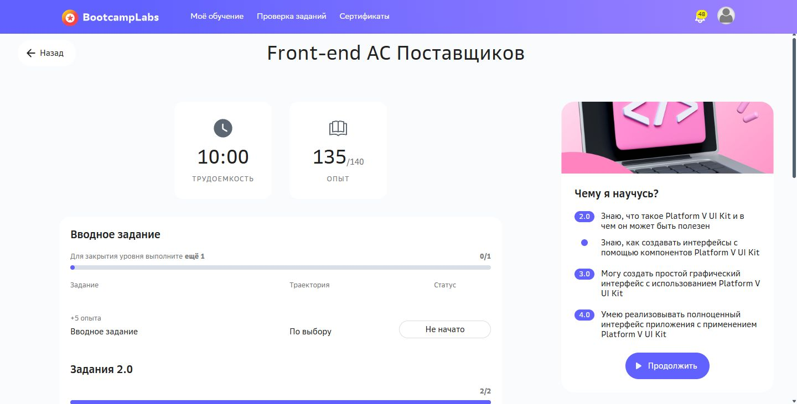

# Практическая работа №4

Четыре модели взаимодействия RSocket

Кашпирев Михаил Дмитриевич

Группа ИКБО-11-23

Связь с курсом: **Front-end АС Поставщиков**.


## Реализация

RSocket работает через настоящий TCP-транспорт Netty. Модель Delivery связывает заказ поставщика, товар и адрес доставки: id, orderId, product, address, status. Эту же модель использует практика №7, что позволяет сравнить протоколы на одинаковом сценарии.

| Модель | Запрос | Ответ |
|---|---|---|
| Request-Response | Идентификатор 1 | JSON доставки |
| Request-Stream | Идентификатор 1 | CREATED → ACCEPTED → IN_TRANSIT → DELIVERED, шаг 350 ms |
| Fire-and-Forget | DeliveryViewed:1 | Запись события сервером без прикладного ответа |
| Channel | courier-ready, position, delivered | Поток подтверждений ack |

Запрос идентификатора 999 возвращает ошибку сервера; клиент перехватывает её через onErrorResume и продолжает демонстрацию. Payload освобождается после чтения, сетевые ресурсы закрываются в finally. Клиент обрабатывает входящие элементы Project Reactor: map, filter, doOnNext.

```powershell
.\run.ps1 demo
# Для двух отдельных процессов:
.\run.ps1 server
# Во втором терминале:
.\run.ps1 client
```

Порт по умолчанию 7104; переменная окружения RSOCKET_PORT меняет его. `block` использован в main для ожидания результатов консольной демонстрации, а обработчики RSocket возвращают Mono/Flux.

Проверенный запуск выполнен в Linux контейнере: `docker compose up --build --abort-on-container-exit --exit-code-from rsocket-demo`. Все четыре модели завершились успешно, код выхода 0; полный вывод — `run.log`, скриншоты — `screenshots`. На этом Windows прямой запуск JDK сталкивается с ошибкой селектора; для воспроизводимой демонстрации используйте Docker. Dockerfile использует приложенные target/classes и target/dependency. Для сборки исходников отдельно сохранён Dockerfile.source; также можно выполнить Maven package dependency:copy-dependencies.

Документация: https://rsocket.io/ и https://github.com/rsocket/rsocket-java


## BootcampLabs



Обязательные задания соответствующего модуля зачтены; общий прогресс курса 100%. Необязательные вводные задания на странице модуля могут оставаться «Не начато».

## Подробный разбор реализации

Отчёт редакции v1.1 содержит 17 страниц: [открыть DOCX](Практика_04_Кашпирев_МД.docx). [Проверка требований](../Проверка_заданий.md).

### Сетевой обмен RSocket

RSocket задаёт несколько моделей взаимодействия поверх поддерживаемого транспорта. В работе используется TCP и одна клиентская связь с сервером. Передаваемый Payload содержит данные запроса или ответа; прикладной объект сериализуется в JSON. Формат JSON выбран для читаемости демонстрации, а сам протокол RSocket передаёт сообщения в собственных кадрах.

Подключение создаётся RSocketConnector, приём запросов — RSocketServer и SocketAcceptor. Сервер реализует интерфейс RSocket, где для каждой модели определён отдельный метод. Поэтому выбор операции здесь связан с моделью обмена, без HTTP URL и методов. В учебной программе Request-Response и Request-Stream принимают текстовый идентификатор доставки. Полноценная маршрутизация через metadata не требуется для выбранного набора операций.

### Четыре модели взаимодействия

Request-Response означает один запрос и один прикладной результат либо ошибку. Request-Stream начинается одним запросом, после которого сервер выдаёт последовательность результатов. Fire-and-Forget передаёт событие без прикладного ответа от сервера. Успешное завершение локального Mono<Void> у отправителя не является подтверждением того, что событие уже сохранено в устойчивой базе.

Channel принимает Publisher запросов и возвращает Flux ответов. Это двусторонний поток в рамках одного взаимодействия, а не серия независимых HTTP-вызовов. В программе курьер отправляет три сообщения, сервер реагирует подтверждением ack на каждое. Здесь ответы производны от входных сообщений; независимая генерация второго потока не нужна для подтверждения модели Channel.

### Reactor и постепенное получение

Mono представляет ноль или один результат, Flux — последовательность элементов. На стороне клиента map извлекает полезные данные, filter исключает пустые строки, doOnNext регистрирует каждый полученный элемент, а onErrorResume обрабатывает отказ. Поток не собирается целиком в List перед выводом: CLIENT STREAM появляется при каждом поступлении.

delayElements задаёт временные интервалы публикации без Thread.sleep в сетевом обработчике. Полученные отметки Instant.now позволяют наблюдать постепенность передачи. В точке входа консольной демонстрации block и blockLast удерживают main до завершения каждого сценария; серверные методы возвращают Mono и Flux, не ожидая их синхронно внутри обработчика.

### Доставка товара как модель предметной области

Delivery содержит id, orderId, product, address и status. Доставка 1 относится к заказу 101 с товаром SSD 1TB и московским адресом. Таким образом, поток представляет сведения о заказанном товаре и его состоянии, пригодные для отображения клиентом АС Поставщиков. Эта же модель используется в практике №7, чтобы сравнение протоколов не зависело от смены предметной области.

ObjectMapper преобразует record в JSON. Входные текстовые сообщения Channel намеренно проще полной доменной модели: courier-ready обозначает готовность, position передаёт координаты, delivered сообщает о завершении. Сервер демонстрации не сохраняет изменения доставки между запросами: четыре состояния Request-Stream формируются для показа механизма передачи.

### Сервер и владение Payload

Метод responder возвращает реализацию RSocket с четырьмя переопределёнными методами. consume получает строку UTF-8 и обязательно вызывает Payload.release в finally. Такая очистка важна для объектов с подсчётом ссылок, используемых сетевой библиотекой. После release данные Payload нельзя продолжать читать; поэтому строка сохраняется до освобождения.

Request-Response сравнивает идентификатор с 1 и возвращает Delivery либо Mono.error. Request-Stream аналогично проверяет существование, затем создаёт Flux четырёх состояний с задержкой 350 мс. Каждый статус преобразуется в новый объект с теми же идентификаторами, товаром и адресом. Ошибка отсутствия объекта становится сигналом реактивного результата, а не корректным JSON с пустой доставкой.

### Клиентские цепочки и ошибки

Клиент сначала запрашивает доставку 1, затем 999. Вторая цепочка использует onErrorResume: сообщает CLIENT HANDLED и заменяет ошибку на Mono.empty. Это позволяет перейти к демонстрации потока и не завершить main необработанным исключением. Первый успешный ответ и отрицательная проверка выполняются через настоящее RSocket-соединение.

Поток Request-Stream проходит consume, filter, map(String::trim) и doOnNext. Fire-and-Forget отправляет DeliveryViewed:1. Channel формируется Flux.just из трёх сообщений с задержкой 180 мс и преобразованием в Payload. Сервер выводит SERVER channel received и возвращает ack, которое клиент регистрирует отдельной строкой.

### Режимы запуска и завершение

Аргумент demo запускает обе стороны в одном JVM-процессе. При этом клиент подключается к слушающему TCP-порту, а не вызывает responder как обычный Java-метод. Режим server оставляет сервер работать, client запускает только клиентскую сторону. Порт задаётся через RSOCKET_PORT, по умолчанию 7104. Обе стороны используют loopback, поэтому раздельные режимы рассчитаны на один хост или общее сетевое пространство.

Проверенная демонстрация выполнена в Linux-контейнере Java 21, что устраняет зависимость от особенностей сетевого окружения Windows. После сценариев finally освобождает клиент и сервер. Строка ALL FOUR MODELS COMPLETE и код выхода 0 вместе подтверждают нормальное завершение; наличие только стартового сообщения сервера такого подтверждения не давало бы.

### Проверенные сценарии

| Проверка | Данные | Результат |
|---|---|---|
| Получение объекта | requestResponse("1") | id 1, orderId 101, CREATED |
| Отсутствующий объект | requestResponse("999") | Delivery not found; работа продолжена |
| Поток | requestStream("1") | CREATED, ACCEPTED, IN_TRANSIT, DELIVERED |
| Событие | DeliveryViewed:1 | SERVER fire-and-forget |
| Канал | Три сообщения курьера | Три подтверждения ack |
| Завершение | После всех цепочек | ALL FOUR MODELS COMPLETE; exit 0 |

### Разбор результатов

Время первого элемента потока — 15:33:44.475669170 UTC, последнего — 15:33:45.565925504 UTC. Между ними переданы ACCEPTED и IN_TRANSIT; общая продолжительность около 1,09 секунды. Это соответствует трём интервалам между четырьмя результатами и показывает, что клиент получает обновления последовательно, а не после накопления готового массива.

В логах серверные операции и клиентские ответы связаны одинаковыми идентификаторами и данными. Имена reactor-tcp-epoll отражают выполнение сетевого обмена в контейнере. Ошибка 999 находится перед успешным Request-Stream и Channel: продолжение после неё непосредственно подтверждено протоколом. Fire-and-Forget подтверждён получением события сервером, но не измерением его устойчивого сохранения.

### Ограничения

Это демонстрационный протокол без аутентификации, базы и TLS. Request-Stream генерирует заданные состояния, а Channel возвращает подтверждения сообщений. Для рабочего сервиса потребовались бы проверка ролей, маршрутизация операций и определение гарантии доставки событий.
