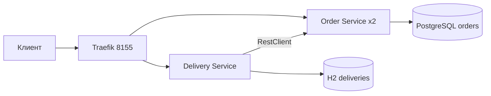

# Практическая работа №5

Контейнеры и маршрутизация доставки

Кашпирев Михаил Дмитриевич

Группа ИКБО-11-23

Связь с курсом: **BaaS для АС сервиса доставки**.


## Архитектура



Два отдельных Spring Boot-приложения со своими pom.xml и Dockerfile. Внешний клиент обращается только к Traefik: `/api/orders` и `/api/deliveries`. Маршруты заданы Docker Labels; внутренние порты сервисов и БД не публикуются.

Order Service хранит заказы в PostgreSQL. Delivery Service запрашивает заказ через RestClient с таймаутами 2/3 s и записывает доставку в своё хранилище. Повторный POST для одного orderId возвращает существующую доставку; уникальный ключ БД исключает дубль.

```powershell
docker compose up --build
# Демонстрация двух экземпляров и остановки одного:
.\demo.ps1
```

Обязательные компоненты запускаются одной командой. Для балансировки используется `docker compose up -d --build --scale orders=2 --wait`. Сервис заказов возвращает `instance`, равный HOSTNAME контейнера; несколько GET через Traefik позволяют видеть смену экземпляров. Оба экземпляра работают с общей PostgreSQL, поэтому содержимое заказов одинаково.

`demo.ps1` выводит контейнеры, выполняет 8 запросов, создаёт доставку заказа 101, останавливает один экземпляр, проверяет доступность через оставшийся и запускает остановленный обратно в finally.

| Параметр | Назначение |
|---|---|
| PORT | Порт приложения |
| DB_URL, DB_USER, DB_PASSWORD | Подключение к своей БД |
| ORDER_URL | Адрес Order Service |
| HOSTNAME | Идентификатор экземпляра |

Docker healthcheck использует Actuator; orders стартует после готовности PostgreSQL, deliveries — после готовности orders. Публичный адрес: http://127.0.0.1:8155.

Проверка выполнена: пять контейнеров healthy, запросы через Traefik обслужены двумя экземплярами Order Service, Delivery получил заказ 101. При остановке одного экземпляра три запроса успешно выполнил оставшийся, затем первый восстановлен. Фактический вывод — run.log; скриншоты — screenshots. Применён Traefik 3.6.1, совместимый с Docker Desktop 29. Схема PostgreSQL создаётся schema.sql при первичной инициализации базы до запуска реплик.


## BootcampLabs


Обязательные задания соответствующего модуля зачтены; общий прогресс курса 100%. Необязательные вводные задания на странице модуля могут оставаться «Не начато».

## Сборка образов

Основные Dockerfile используют готовые `target/app.jar`, приложенные к проекту. Для запуска через Compose достаточно Docker Desktop. Исходники и pom.xml сохранены; для пересборки нужен JDK 21 и Maven 3.9: `mvn package` в каждом каталоге сервиса. Dockerfile.source также содержит вариант полной сборки из исходников в контейнере.

## Подробный разбор реализации

Отчёт редакции v1.1 содержит 19 страниц: [открыть DOCX](Практика_05_Кашпирев_МД.docx). [Проверка требований](../Проверка_заданий.md).

### Границы распределённого приложения

Заказ и доставка связаны одним бизнес-сценарием, но выполняют разные функции. Order Service хранит содержание заказа и его стоимость, Delivery Service отвечает за доставку выбранного заказа. Разделение на два приложения позволяет независимо запускать компоненты и наблюдать сетевое взаимодействие между ними. Оно также вводит частичные отказы: доставка может быть доступна, когда заказ временно недоступен, и наоборот.

REST API передаёт данные в JSON поверх HTTP. В отличие от прямого вызова Java-метода, удалённый запрос может завершиться сетевой ошибкой, таймаутом или кодом отсутствия объекта. Delivery Service переводит такие ситуации в понятные клиенту HTTP-ответы. Для синхронного получения заказа используется RestClient, что соответствует обычным Spring MVC-обработчикам этой практики.

### Контейнеры конфигурация и готовность

Dockerfile описывает образ одного приложения, compose.yaml — совместный запуск сервисов, сети, томов и зависимостей. Исполняемые app.jar включены в материалы; основной Dockerfile копирует готовую сборку и запускает Java 21. Dockerfile.source предназначен для полной сборки из Maven-исходников. Эти варианты различаются способом получения артефакта, но запускают одно приложение.

Запущенный процесс ещё не означает готовность API и базы. healthcheck выполняет реальную проверку: pg_isready для PostgreSQL, Actuator для Spring Boot и ping для Traefik. depends_on с условием service_healthy задерживает запуск зависимого приложения до успешной проверки. Параметры подключения передаются окружением, поэтому адрес внутри сети Docker не требуется прописывать в Java-коде.

### Маршрутизация и балансировка Traefik

Traefik является внешней точкой входа на порту 8155. Router выбирает сервис по правилу PathPrefix, а service задаёт порт приложения и доступные экземпляры. Docker provider читает эти настройки из labels контейнеров. При exposedByDefault=false проксирование включается только для явно отмеченных приложений.

Масштабирование Order Service создаёт две реплики одного образа. Они используют общую PostgreSQL, поэтому могут возвращать одинаковые заказы, а поле instance различает процесс, обслуживший запрос. Балансировка подтверждается появлением двух значений instance в последовательных ответах. Строгое чередование в каждом запросе не является критерием задания: достаточно того, что обращения действительно обслуживают разные работоспособные экземпляры.

### Ответственность сервисов и данные

OrderApplication реализует GET списка, GET по идентификатору и POST заказа. Order содержит id, product, quantity, total и address. PostgreSQL хранит записи и последовательность order_seq. При POST проверяются положительные quantity и total, непустые product и address. Идентификатор выдаётся базой, поэтому две реплики не конкурируют за локальный счётчик.

DeliveryApplication реализует GET списка и POST по orderId. Собственная H2 хранит order_id, product, address и status. При создании сведения о товаре и адресе берутся из ответа Order Service; клиенту достаточно передать идентификатор заказа. Уникальность order_id предотвращает создание второй строки доставки при повторном запросе. Поскольку ответ POST сохраняет 201 и для существующей записи, это учебная идемпотентность данных, а не строгое различение создания и повторного чтения HTTP-кодом.

### Межсервисный запрос и ошибки

RestClient создаётся с базовым адресом из orders.base-url. Для запроса /api/orders/{id} используются connect timeout 2 секунды и read timeout 3 секунды. Если Order Service возвращает 404, клиент доставки получает 404 Order not found. Ошибки RestClient становятся 503 Order Service unavailable; пустой успешный ответ трактуется как 502 Empty order. Неположительный orderId отклоняется до обращения к сети.

После успешного ответа сервис вставляет доставку CREATED. При DuplicateKeyException возвращается ранее существующая запись. Это не скрывает ошибки связи: перехват дубликата расположен только вокруг INSERT. В учебной схеме отдельная транзакция распределённого создания заказа и доставки не используется, потому что доставка формируется для уже сохранённого заказа.

### База конфигурация и запуск реплик

Схема PostgreSQL и начальный заказ 101 создаются скриптом, подключённым в /docker-entrypoint-initdb.d. Для Order Service SQL-инициализация приложения отключена. В результате схему создаёт сама база перед готовностью реплик; два приложения не пытаются одновременно выполнять первоначальный DDL.

DB_URL, DB_USER, DB_PASSWORD, PORT и ORDER_URL задаются в Compose и читаются application.properties. Адреса orders-db и orders являются именами сервисов внутренней сети. Внешнему клиенту эти имена не нужны. Идентификатор процесса возвращается через instance.id, основанный на HOSTNAME контейнера. Именованные тома сохраняют данные PostgreSQL и H2 независимо от пересоздания образов.

### Правила Traefik и внешний доступ

На orders установлены labels traefik.enable=true, router rule PathPrefix(`/api/orders`) и loadbalancer.server.port=8080. Для deliveries задана аналогичная пара с /api/deliveries. Traefik получает сведения о контейнерах через read-only подключение Docker socket. Порты обоих приложений и PostgreSQL не опубликованы на хост; HTTP-проверки демонстрации идут через localhost:8155.

Сервис доставки обращается к orders внутри сети, тогда как внешний клиент обращается через Traefik. Это два разных маршрута: внутренний вызов подтверждает бизнес-связь, внешний — инфраструктурную маршрутизацию. Балансировка внешних запросов не доказывает автоматически такую же политику у внутреннего RestClient.

### Контроль работоспособности и отказ реплики

Compose запускается с --scale orders=2 и --wait. demo.ps1 получает восемь ответов списка, создаёт доставку заказа 101, затем останавливает один экземпляр Order Service и выполняет ещё три обращения через Traefik. В finally остановленная реплика запускается снова, поэтому демонстрация не оставляет систему в состоянии искусственного отказа.

Остановка одного экземпляра проверяет доступность при частичном отказе приложения. Она не проверяет отказ общей PostgreSQL или самого Traefik: эти компоненты остаются единичными. Две реплики повышают доступность только при условии, что база и внешняя точка входа продолжают работать.

### Проверенные сценарии

| Проверка | Данные | Результат |
|---|---|---|
| Готовность | Traefik, PostgreSQL, 2 orders, delivery | Все пять healthy |
| Балансировка | 8 GET /api/orders | instance 3f80ebbacf7d и 79099fe78870 |
| Взаимодействие | POST /api/deliveries: orderId 101 | SSD 1TB; московский адрес; CREATED |
| Частичный отказ | Остановлен 3f80ebbacf7d | Три ответа от 79099fe78870 |
| Восстановление | Возврат остановленного контейнера | demo.ps1 выполняет start в finally |

### Разбор результатов

Восемь ответов содержат один и тот же заказ 101 стоимостью 63 200, но два различных instance. Это подтверждает общность хранилища и обработку запросов разными репликами. После остановки 3f80ebbacf7d ответы продолжают содержать заказ и instance оставшегося процесса 79099fe78870. В протоколе нет перехода к прямому порту приложения: адрес проверки остаётся Traefik.

Созданная доставка содержит товар и адрес заказа, полученные по RestClient. Совместное подтверждение внешнего POST, содержимого ответа и наличия двух приложений показывает требуемую цепочку клиент → Delivery → Order. Проверка сохранена в run.log вместе с запуском и состоянием контейнеров; повторение выполняется тем же demo.ps1.

### Ограничения

Система проверена локально. У Traefik и PostgreSQL нет резервных экземпляров; автоматическое развёртывание в облаке и авторизация не реализованы. Масштабируется Order Service, а файловая H2 Delivery Service рассчитана на один экземпляр.
