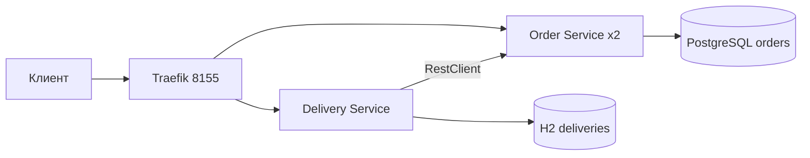
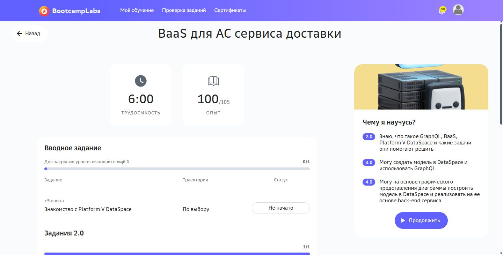

# Практическая работа №5

Контейнеры и маршрутизация доставки

Кашпирев Михаил Дмитриевич

Группа ИКБО-11-23

Связь с курсом: **BaaS для АС сервиса доставки**.


## Архитектура



Два отдельных Spring Boot-приложения со своими pom.xml и Dockerfile. Внешний клиент обращается только к Traefik: `/api/orders` и `/api/deliveries`. Маршруты заданы Docker Labels; внутренние порты сервисов и БД не публикуются.

Order Service хранит заказы в PostgreSQL. Delivery Service запрашивает заказ через RestClient с таймаутами 2/3 s и записывает доставку в своё хранилище. Повторный POST для одного orderId возвращает существующую доставку; уникальный ключ БД исключает дубль.

```powershell
docker compose up --build
# Демонстрация двух экземпляров и остановки одного:
.\demo.ps1
```

Обязательные компоненты запускаются одной командой. Для балансировки используется `docker compose up -d --build --scale orders=2 --wait`. Сервис заказов возвращает `instance`, равный HOSTNAME контейнера; несколько GET через Traefik позволяют видеть смену экземпляров. Оба экземпляра работают с общей PostgreSQL, поэтому содержимое заказов одинаково.

`demo.ps1` выводит контейнеры, выполняет 8 запросов, создаёт доставку заказа 101, останавливает один экземпляр, проверяет доступность через оставшийся и запускает остановленный обратно в finally.

| Параметр | Назначение |
|---|---|
| PORT | Порт приложения |
| DB_URL, DB_USER, DB_PASSWORD | Подключение к своей БД |
| ORDER_URL | Адрес Order Service |
| HOSTNAME | Идентификатор экземпляра |

Docker healthcheck использует Actuator; orders стартует после готовности PostgreSQL, deliveries — после готовности orders. Публичный адрес: http://127.0.0.1:8155.

Проверка выполнена: пять контейнеров healthy, запросы через Traefik обслужены двумя экземплярами Order Service, Delivery получил заказ 101. При остановке одного экземпляра три запроса успешно выполнил оставшийся, затем первый восстановлен. Фактический вывод — run.log; скриншоты — screenshots. Применён Traefik 3.6.1, совместимый с Docker Desktop 29. Схема PostgreSQL создаётся schema.sql при первичной инициализации базы до запуска реплик.


## BootcampLabs



Обязательные задания соответствующего модуля зачтены; общий прогресс курса 100%. Необязательные вводные задания на странице модуля могут оставаться «Не начато».

## Сборка образов

Основные Dockerfile используют готовые `target/app.jar`, приложенные к проекту. Для запуска через Compose достаточно Docker Desktop. Исходники и pom.xml сохранены; для пересборки нужен JDK 21 и Maven 3.9: `mvn package` в каждом каталоге сервиса. Dockerfile.source также содержит вариант полной сборки из исходников в контейнере.
