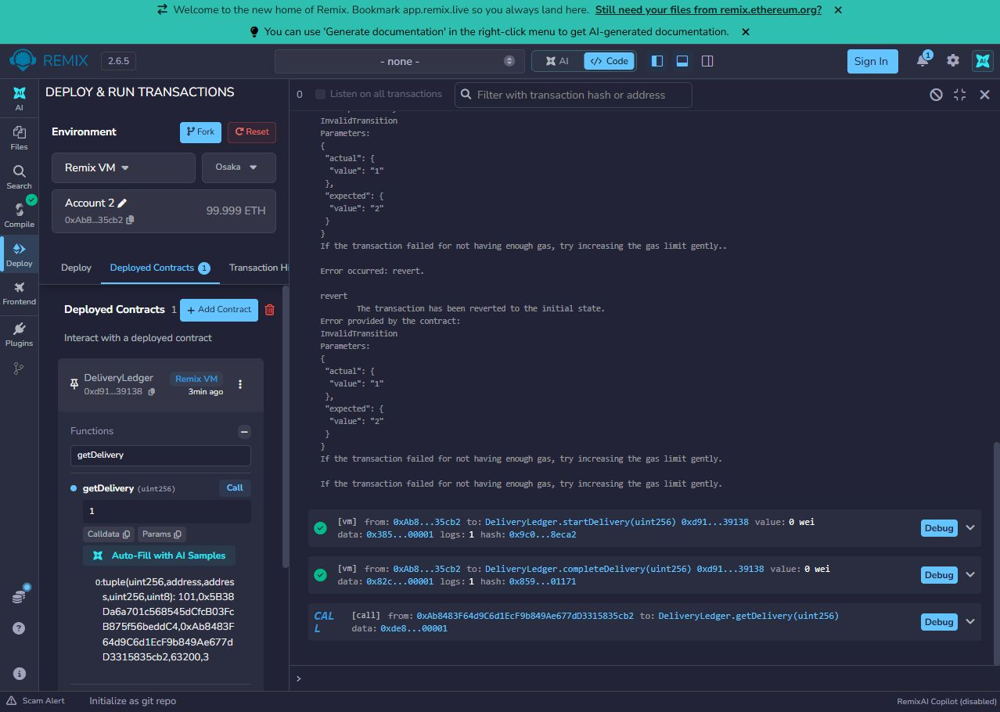
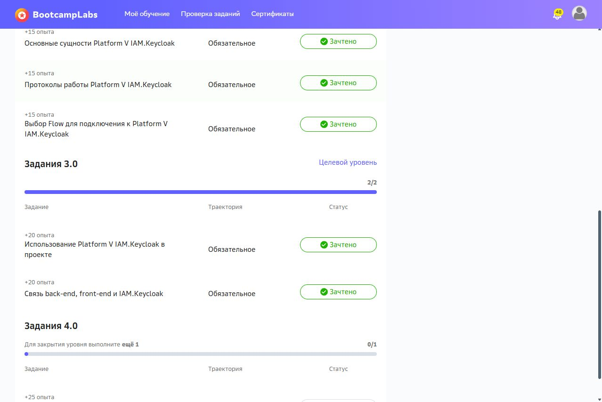

# Практическая работа №6 — Solidity

**Кашпирев Михаил Дмитриевич, ИКБО-11-23.**

DeliveryLedger реализован и проверен в Remix IDE 2.6.5, компилятор 0.8.34, среда Remix VM Osaka. Полный отчёт: [DOCX](../Отчёты/Практика_06_Кашпирев_МД.docx). Проверка выполнена 4 октября 2026 года.

## Контракт

Исходник: [DeliveryLedger.sol](contracts/DeliveryLedger.sol). Solidity ^0.8.24, без внешних библиотек. Данные: orderId, customer, courier, price, status. deliveryId — ключ mapping; nextId выдаёт номера с единицы. price — справочная стоимость в условных денежных единицах; контракт не принимает и не переводит ETH.

| Операция | Кто и когда может выполнить |
|---|---|
| createDelivery | Любой клиент; положительная стоимость и новый orderId |
| assignCourier | Оператор или заказчик; только Created, курьер не нулевой и не заказчик |
| startDelivery | Назначенный курьер; только Accepted |
| completeDelivery | Назначенный курьер; только InTransit |
| cancelDelivery | Оператор или заказчик; Created или Accepted |
| getDelivery | Любой адрес; существующая запись |

```text
Created → Accepted → InTransit → Delivered
   └────────┴──→ Cancelled
```

Модификаторы exists и onlyCourier, require, ошибки Unauthorized, UnknownDelivery и InvalidTransition контролируют условия. События: DeliveryCreated, CourierAssigned и DeliveryStatusChanged. Повторная регистрация orderId запрещена.

## Реальная проверка Remix

| Проверка | Фактический результат |
|---|---|
| Account 1 создаёт заказ 101, price 63200 | getDelivery(1) возвращает status 0 |
| Account 1 назначает Account 2 | Два события, состояние Accepted |
| Account 1 пытается завершить | revert Unauthorized |
| Account 2 пытается завершить до начала | revert InvalidTransition actual 1 expected 2 |
| Account 2 выполняет startDelivery и completeDelivery | Обе транзакции успешны, status 3 Delivered |
| Account 1 отменяет завершённую доставку | revert Delivery already started |

Сводка фактических параметров: [run.log](run.log). Состояния интерфейса: remix-created.txt, remix-unauthorized.txt, remix-invalid-transition.txt, remix-delivered.txt, remix-checks.txt. Хеши в сводке сокращены так же, как на экране. Инструкция повторения: [remix-scenario.md](remix-scenario.md).



## BootcampLabs

Предметная область — «Доступы и front-end АС сервиса доставки». Модуль завершён на целевом уровне 3.0: обязательные задания 2.0 — 4/4, задания 3.0 — 2/2, опыт 100/130. Общий прогресс личного курса — 100%. Вводное задание и расширение 4.0 являются необязательными.



Собственный репозиторий: https://github.com/MikhailBOBR/PiRKSP_2_Kashpirev.

## Подробный разбор реализации

Отчёт редакции v1.1 содержит 21 страниц: [открыть DOCX](Практика_06_Кашпирев_МД.docx). [Проверка требований](../Проверка_заданий.md).

### Состояние контракта и виртуальная машина

Смарт-контракт определяет правила изменения собственного состояния в EVM. Для доставки ценность такого подхода состоит в проверке последовательности этапов и адреса отправителя каждой операции. В контракт вынесены идентификатор заказа, участники, стоимость и статус. Каталог товаров, адрес доставки и интерфейс Bootcamp остаются вне него: задача требует небольшую часть бизнес-логики, а не перенос всей системы в блокчейн.

Solidity-компилятор создаёт байткод и ABI для вызова функций. pragma ^0.8.24 допускает совместимый компилятор семейства 0.8; в фактической проверке использована версия 0.8.34+commit.80d5c536. Remix VM Osaka выполняет байткод в учебной среде с тестовыми аккаунтами. Результаты относятся к этой VM, а не к публикации в основной сети Ethereum.

### Транзакция вызов и откат

createDelivery, assignCourier, startDelivery, completeDelivery и cancelDelivery изменяют состояние и вызываются транзакциями. getDelivery имеет модификатор view и возвращает запись без изменения. Для проверки важно наблюдать оба вида действий: успешная транзакция показывает принятие операции, а последующий getDelivery подтверждает итоговые поля.

При require или revert отклонённая транзакция не применяет изменения состояния и не сохраняет её события. Пользовательская ошибка Unauthorized отличается от InvalidTransition: первая обозначает неподходящего отправителя, вторая — неподходящий этап доставки. Поэтому отрицательные проверки выполняются отдельно, с правильной ролью в тесте состояния и неправильной ролью в тесте доступа.

### Идентификация ролей и события

Контракт определяет участника по msg.sender. Заказчик записывается при создании, оператор — при развёртывании, курьер — при назначении. Наличие роли в IAM.Keycloak не превращает пользователя автоматически в адрес EVM. В этой работе воспроизводится смысл разделения полномочий из Bootcamp; интеграция JWT, кошельков и Keycloak не реализуется.

Событие записывает факт изменения в лог успешной транзакции. indexed-поля deliveryId, orderId, customer и courier позволяют выбирать интересующие записи по темам. Текущее состояние всё равно читается из getDelivery: лог событий и запись mapping выполняют разные задачи. DeliveryCreated фиксирует регистрацию, CourierAssigned — назначение, DeliveryStatusChanged — прежнее и новое состояние.

### Модель Delivery и уникальность заказа

Структура Delivery содержит orderId, customer, courier, price и Status. deliveryId является ключом mapping, поэтому отдельное поле идентификатора внутри структуры не требуется. nextId начинается с 1 и увеличивается при создании. Неизвестный ключ mapping возвращал бы структуру нулевых значений, поэтому exists проверяет customer на address(0) и возвращает UnknownDelivery.

createDelivery проверяет положительные orderId и price и отсутствие заказа в orderRegistered. Затем сохраняет заказчика msg.sender, нулевой адрес курьера и Created. orderRegistered предотвращает вторую регистрацию того же orderId даже после отмены. price — условная справочная стоимость: функции nonpayable, ETH не переводится и схема оплаты доставки не заявляется.

### Состояния и допустимые переходы

Enum Status задаёт Created = 0, Accepted = 1, InTransit = 2, Delivered = 3 и Cancelled = 4. assignCourier допускается только из Created и переводит доставку в Accepted. startDelivery требует Accepted и переводит в InTransit; completeDelivery требует InTransit и переводит в Delivered. Внешней функции произвольной записи status нет.

cancelDelivery разрешена только в Created или Accepted. Отменить InTransit, Delivered и уже Cancelled нельзя. Следовательно, Delivered и Cancelled являются конечными состояниями этой модели. Прямой Created → Delivered закрыт не только проверкой expected InTransit, но и тем, что до назначения курьера роль onlyCourier не может быть выполнена обычным аккаунтом.

### Полномочия и порядок проверок

Назначить курьера может оператор или заказчик конкретной доставки. Проверяются ненулевой адрес и отличие от заказчика. Отправить и завершить доставку может только назначенный курьер. Отменить — оператор или заказчик, пока состояние разрешает отмену. Один и тот же пользователь не получает права курьера только из-за того, что создал запись.

exists выполняется до onlyCourier в функциях движения. Затем expect сравнивает текущее состояние с нужным. Такой порядок даёт понятную классификацию ошибок: неизвестная запись, неверный участник, неверный этап. Приватный change обновляет статус и выпускает событие с предыдущим состоянием; все разрешённые переходы используют этот метод.

### События и код проверки

Создание выпускает один DeliveryCreated. Назначение курьера выпускает CourierAssigned и DeliveryStatusChanged, потому что одновременно меняются исполнитель и этап. Начало, завершение и отмена выпускают по одному DeliveryStatusChanged. Отклонённые операции не дают сохранённых событий изменения. В журнале Remix это отражается количеством logs успешных транзакций и ошибками revert.

Контракт не выполняет внешних вызовов и не принимает средства; поэтому основной объект проверки — контроль доступа и состояний. Здесь не нужны предположения о платёжной безопасности, которые код не реализует. Исходник с pragma, модификаторами и всеми функциями приложен в contracts/DeliveryLedger.sol.

### Последовательность проверки в Remix

Account 1 развёртывает контракт и создаёт доставку заказа 101 со стоимостью 63200. Этот аккаунт становится оператором и заказчиком. Account 2 назначается курьером. До успешной отправки выполняются два отказа: Account 1 пытается завершить чужую для него курьерскую операцию, затем Account 2 пытается завершить доставку ещё в Accepted.

После отказов Account 2 вызывает startDelivery и completeDelivery. getDelivery возвращает тот же orderId, заказчика, адрес курьера и status 3. Account 1 затем пытается отменить завершённую доставку; контракт сообщает Delivery already started. Эти проверки охватывают успешный жизненный цикл и запреты по двум независимым причинам.

### Проверенные сценарии

| Проверка | Данные | Результат |
|---|---|---|
| createDelivery | Account 1; (101, 63200) | Доставка 1, Created = 0 |
| assignCourier | Account 1; адрес Account 2 | Accepted = 1; два события |
| Неправильная роль | Account 1: completeDelivery(1) | Unauthorized; откат |
| Пропуск этапа | Account 2: complete до start | InvalidTransition(1, 2); откат |
| Начало и завершение | Account 2: start, затем complete | InTransit = 2 → Delivered = 3 |
| Отмена после завершения | Account 1: cancelDelivery(1) | Delivery already started; откат |

### Разбор результатов

Адрес оператора и заказчика — 0x5B38Da6a701c568545dCfcB03FcB875f56beddC4, адрес курьера — 0xAb8483F64d9C6d1EcF9b849Ae677dD3315835cb2. Это открытые адреса тестовых аккаунтов, используемые как параметры проверки. Секретные ключи для отчёта не нужны. Вызовы отправлены с Value = 0 wei.

Сначала отказ по роли показывает, что наличия доставки недостаточно для её завершения. Затем отказ InvalidTransition при верной роли показывает независимую проверку состояния. Успешный getDelivery после start и complete подтверждает status 3, а отказ отмены подтверждает конечность завершённого состояния. Полные тексты интерфейса сохранены в remix-*.txt; run.log представляет сводку фактически выполненных операций.

Хэши в сводке сокращены так, как они были показаны интерфейсом; по ним не заявляется поиск в публичном обозревателе блоков. Стоимость газа отдельным сравнительным экспериментом не измерялась. Результат проверки относится к функциональному поведению исходного контракта в Remix VM.

### Ограничения

У контракта нет оплаты, связи с реальным трекингом курьера и интеграции IAM. VM является учебной средой. Для рабочего применения понадобятся управление адресами участников, политика смены оператора и аудит правил доступа; такие функции не включены в задание текущей модели.
