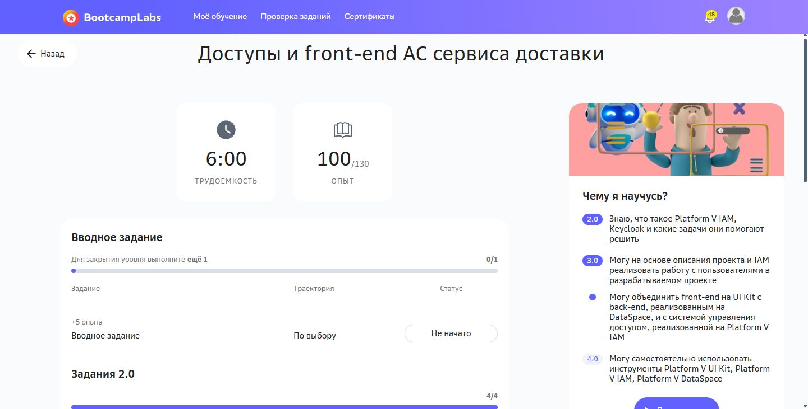

# Практическая работа №6

Смарт контракт реестра доставки

Кашпирев Михаил Дмитриевич

Группа ИКБО-11-23

Связь с курсом: **Доступы и front-end АС сервиса доставки**.


## Реализация

Исходный код: `contracts/DeliveryLedger.sol`. Solidity ^0.8.24, без внешних контрактов и библиотек. Среда выполнения по заданию — Remix IDE, локальная Remix VM.

Delivery: orderId, customer, courier, price, status. deliveryId — ключ mapping; nextId нумерует записи с единицы. Enum: Created, Accepted, InTransit, Delivered, Cancelled.

Роли определяются адресами: operator — создатель контракта, customer — создатель конкретной доставки, courier — назначенный ей исполнитель.

| Действие | Разрешено |
|---|---|
| createDelivery | Любому клиенту, новый orderId и положительная цена |
| assignCourier | Оператору или владельцу; только Created |
| startDelivery | Назначенному курьеру; только Accepted |
| completeDelivery | Назначенному курьеру; только InTransit |
| cancelDelivery | Оператору или владельцу; до начала движения |
| getDelivery | Чтение существующей записи любым адресом |

```text
Created → Accepted → InTransit → Delivered
   └────────┴──→ Cancelled
```

Проверки: exists, onlyCourier, require, ошибки Unauthorized, UnknownDelivery и InvalidTransition. Журнал: DeliveryCreated, CourierAssigned, DeliveryStatusChanged. Один orderId нельзя зарегистрировать дважды.

price — справочная сумма в копейках; контракт не принимает и не переводит ETH. Отмена после InTransit и завершение до начала движения запрещены.

Пошаговая инструкция и отрицательные проверки: `remix-scenario.md`. Исходник подготовлен; компиляция, транзакции в Remix и их скриншоты ещё не выполнены. Не считать инструкцию доказательством запуска.

Документация: https://docs.soliditylang.org/en/latest/contracts.html


## BootcampLabs



Обязательные задания соответствующего модуля зачтены; общий прогресс курса 100%. Необязательные вводные задания на странице модуля могут оставаться «Не начато».
