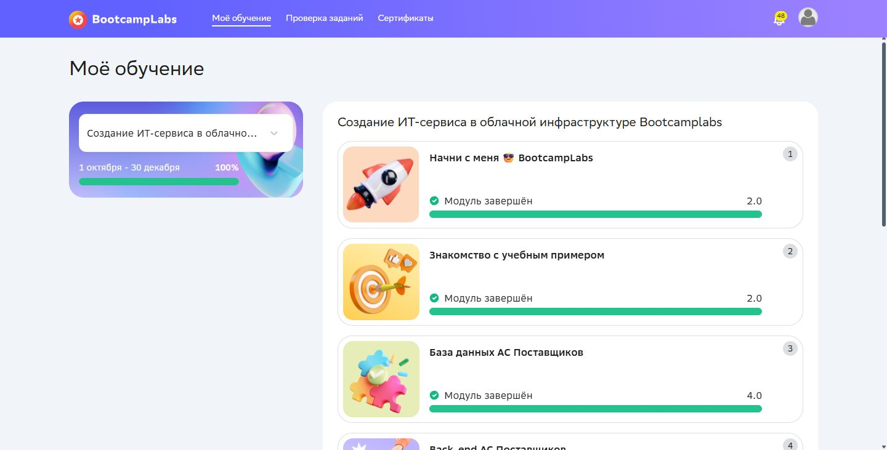

# Практическая работа №7

Реактивный HTTP сервис доставки

Кашпирев Михаил Дмитриевич

Группа ИКБО-11-23

Связь с курсом: **Текущий прогресс BootcampLabs**.


## Реализация

Spring WebFlux, Reactor Netty, модель Delivery из №4: id, orderId, product, address, status. Хранилище — ConcurrentHashMap, поток изменений — Sinks с ограниченным replay.

| HTTP | Путь | Результат |
|---|---|---|
| GET | /api/deliveries | Flux доступных доставок |
| GET | /api/deliveries/{id} | Mono одной доставки |
| POST | /api/deliveries | Создание, 201 |
| PUT | /api/deliveries/{id} | Проверенный переход состояния |
| DELETE | /api/deliveries/{id} | Удаление, 204 |
| GET | /api/deliveries/{id}/stream | SSE с именем delivery-status |
| GET | /api/deliveries/{id}/order | Внешний WebClient GET заказа |

Используются map, filter, flatMap, switchIfEmpty и onErrorResume. В обработчиках нет block и Thread.sleep. Конкурирующие обновления проверяются сравнением старой записи: конфликт возвращает 409. Отсутствующая доставка — 404, некорректные данные — 400, недоступный внешний сервис — 502.

```powershell
docker compose up -d --build --wait
# Order Service включён в этот compose.yaml:
.\demo.ps1
```

Порт 8177; PORT и ORDER_URL меняются через окружение. Начальная доставка 1 соответствует заказу 101. Каждый запуск demo.ps1 создаёт новую доставку, открывает её SSE, выполняет PUT ACCEPTED → IN_TRANSIT → DELIVERED и записывает поток в sse-latest.log. Таким образом, скрипт можно запускать повторно. Исходный подтверждённый запуск сохранён в run.log и sse.log; повторная проверка — repeat-demo.log. SSE публикует реальные изменения из PUT, а не независимый заранее подготовленный список статусов. `curl -N` отключает буферизацию вывода.

## Отличия WebFlux и RSocket

1. WebFlux API здесь использует HTTP, URL и методы GET/POST/PUT/DELETE; №4 — бинарный RSocket поверх TCP.
2. Одному объекту соответствуют HTTP GET + Mono и RSocket Request-Response.
3. Поток WebFlux передаётся как text/event-stream (SSE); RSocket — через Request-Stream.
4. SSE передаёт события от сервера клиенту; RSocket Channel обменивается двумя потоками в одном взаимодействии.
5. Fire-and-Forget и Channel — модели RSocket. HTTP POST имеет HTTP-ответ и сам по себе не является Fire-and-Forget; общего с RSocket использования Mono/Flux недостаточно, чтобы считать протоколы одинаковыми.

Проверено: HTTP CRUD, WebClient к отдельному Order Service и все четыре реальных состояния в SSE. Дополнительные проверки в verification.log подтверждают 201, 204, 404, 409 и 400. Повторный запуск demo.ps1 также выполнен успешно.


## BootcampLabs



Обязательные задания соответствующего модуля зачтены; общий прогресс курса 100%. Необязательные вводные задания на странице модуля могут оставаться «Не начато».

## Сборка образов

Основные Dockerfile используют готовые `target/app.jar`, приложенные к проекту. Для запуска через Compose достаточно Docker Desktop. Исходники и pom.xml сохранены; для пересборки нужен JDK 21 и Maven 3.9: `mvn package` в каждом каталоге сервиса. Dockerfile.source также содержит вариант полной сборки из исходников в контейнере.

## Подробный разбор реализации

Отчёт редакции v1.1 содержит 19 страниц: [открыть DOCX](Практика_07_Кашпирев_МД.docx). [Проверка требований](../Проверка_заданий.md).

### HTTP на Spring WebFlux

WebFlux реализует реактивную обработку HTTP-запросов. Контроллер возвращает Mono или Flux, а фреймворк подписывается на результат и записывает ответ клиенту. В этой работе один объект доставки представлен Mono<Delivery>, список — Flux<Delivery>, удаление — Mono<Void>. Отсутствие объекта и ошибки проверки также передаются внутри реактивной цепочки.

Сервер Reactor Netty обслуживает сетевые события через event loop. Долгое синхронное ожидание внутри обработчика занимало бы поток, необходимый другим соединениям. Поэтому HTTP-методы проекта не вызывают block и Thread.sleep. Небольшие действия над памятью выполняются в Mono.fromCallable; внешний запрос остаётся WebClient-цепочкой. Использование Mono вокруг JDBC само по себе не сделало бы JDBC неблокирующим — эта проблема отдельно рассматривается в практике №8.

### Состояние и горячий поток

ConcurrentHashMap хранит текущие доставки, AtomicLong выдаёт идентификаторы. Неизменяемый record позволяет заменить запись целиком при смене статуса. Сравнение старого значения с data.replace(id, old, new) обнаруживает конкурентное обновление и возвращает 409 вместо незаметной перезаписи.

Для каждой доставки Sinks.Many хранит поток изменений. replay().limit(16) позволяет новой подписке получить ограниченную историю, но это не устойчивое хранилище событий. После перезапуска память теряется. tryEmitNext вызывается после фактического изменения записи, поэтому источник SSE связан с API PUT, а не с независимым таймером заранее заданных состояний.

### SSE и внешний реактивный запрос

Server-Sent Events использует длительный HTTP GET с Content-Type text/event-stream. Каждый элемент имеет поля event, id и data; пустая строка отделяет сообщения. В проекте event равен delivery-status, id включает идентификатор доставки и её состояние, data содержит Delivery. Для просмотра через curl параметр -N отключает буферизацию консольного вывода.

WebClient возвращает Mono ответа Order Service. flatMap связывает найденную доставку с асинхронным запросом заказа, timeout ограничивает ожидание двумя секундами, onErrorResume преобразует ошибку связи в HTTP 502. Ошибка поиска самой доставки сохраняет 404. Таким образом, клиент может различить отсутствующий объект и недоступность внешнего компонента.

### Модель и операции CRUD

Delivery повторяет поля RSocket-практики: id, orderId, product, address и status. Input описывает тело создания или изменения без серверного id. При создании status принудительно устанавливается CREATED, а не принимается произвольно от клиента. Проверка требует положительный orderId и непустые product и address.

GET списка создаёт Flux из актуальных значений хранилища, исключает CANCELLED и сортирует по id. GET по id использует find. POST выделяет следующий номер, сохраняет Delivery и публикует событие; ответ имеет 201. PUT проверяет разрешённый следующий этап, сравнивает прежнюю запись и публикует обновление. DELETE удаляет объект, завершает его Sink и отвечает 204.

### Операторы и отсутствие данных

find использует Mono.defer и Mono.justOrEmpty, чтобы читать карту при подписке, а не заранее. switchIfEmpty заменяет отсутствие значения на ResponseStatusException с 404. В списке используются filter, sort и map; в обновлении и внешнем запросе — flatMap. Для SSE Mono результата поиска преобразуется в Flux через flatMapMany.

Проверка существования выполняется и перед DELETE, и перед SSE-подпиской. Поэтому неизвестная доставка не превращается в бесконечно открытый пустой поток. Удаление возвращает then(), то есть сигнал завершения без тела. Ошибки ввода и недопустимого перехода выбрасываются внутри fromCallable и превращаются в сигнал onError, который WebFlux отображает в HTTP-код.

### Контроль этапов доставки

Разрешённая последовательность: CREATED → ACCEPTED → IN_TRANSIT → DELIVERED. CANCELLED допускается из CREATED и ACCEPTED. Обратный переход и пропуск этапа отклоняются с 409 Invalid status transition. Завершённая доставка не может снова стать CREATED.

Проверка data.replace предотвращает одновременную замену уже изменённого объекта. В отличие от сохранения простой последовательной записи, операция сравнивает саму прежнюю Delivery. Это защищает конкретный PUT от потери конкурирующего изменения. Согласованность публикации нескольких одновременных событий и обработка результата tryEmitNext не рассматриваются как гарантии надёжного событийного журнала.

### Реальный поток изменений и WebClient

Endpoint /api/deliveries/{id}/stream сначала передаёт текущее состояние, затем события Sink. distinctUntilChanged убирает непосредственно повторяющийся объект, который мог попасть и из текущего состояния, и из replay. Метод map строит ServerSentEvent с JSON Delivery. Отдельный Order Service включён в compose.yaml, поэтому внешний вызов не зависит от заранее запущенного вручную приложения.

Endpoint /api/deliveries/{id}/order получает идентификатор заказа из найденной доставки и вызывает /api/orders/{id}. orders.base-url передаётся переменной ORDER_URL. В демонстрации получен заказ 101 со стоимостью 63 200. Поток SSE остаётся односторонним: изменения создаются отдельными PUT-запросами, а клиентская подписка только получает события.

### Практическое сравнение с RSocket

Для одинаковой доставки одиночному Request-Response практики №4 соответствует GET /api/deliveries/{id} с Mono. Request-Stream соответствует GET /api/deliveries/{id}/stream с Flux SSE. В обоих случаях Reactor описывает обработку результата, но на проводе используются разные протоколы: кадры RSocket поверх TCP и HTTP с текстовыми SSE-сообщениями.

В RSocket операция определяется моделью взаимодействия и Payload; в HTTP — методом, URL, заголовками и кодом ответа. SSE передаёт только серверный поток, Channel принимает и отправляет потоки в одном взаимодействии. HTTP POST имеет ответ и не становится Fire-and-Forget от того, что клиент не читает тело. Наконец, HTTP SSE можно смотреть curl или браузерным EventSource, а RSocket требует клиента соответствующего протокола. Эти пять различий также включены в README.

### Проверенные сценарии

| Проверка | Данные | Результат |
|---|---|---|
| Создание | POST корректной доставки | 201; новое значение id |
| Чтение и внешний вызов | GET объекта и /order | Delivery; заказ 101, сумма 63 200 |
| Поток | Подписка и три последовательных PUT | Все четыре состояния в SSE |
| Удаление | DELETE созданной доставки | 204; последующий GET 404 |
| Отсутствующий объект | GET id 999 | 404 Delivery not found |
| Обратный переход | DELIVERED → CREATED | 409 Invalid status transition |
| Ошибка ввода | Некорректный POST | 400 Invalid delivery |
| Повторная демонстрация | Новая доставка на каждый запуск | repeat-demo.log; sse-latest.log |

### Разбор результатов

В исходном прогоне SSE сохранены CREATED, ACCEPTED, IN_TRANSIT и DELIVERED, соответствующие реальным HTTP-изменениям. Дополнительный verification.log содержит конкретные коды 201, 204, 404, 409 и 400. Это проверяет не только чтение положительного примера, но и создание, удаление, отсутствие данных и недопустимые значения.

demo.ps1 создаёт новый объект при каждом запуске, поскольку начальная доставка после первого сценария уже находится в конечном состоянии. Поток повторного запуска записывается в sse-latest.log, а исходный sse.log сохраняется. Такая организация предотвращает ошибку повторного перевода DELIVERED в ACCEPTED при демонстрации и позволяет отделить исходный протокол от последующих проверок.

### Ограничения

Хранилище оперативное: после перезапуска данные и replay теряются. Sink ограничивает историю, но не предоставляет полноценное восстановление по Last-Event-ID. SSE не является двусторонним каналом и не гарантирует получение каждого изменения после разрыва соединения.
