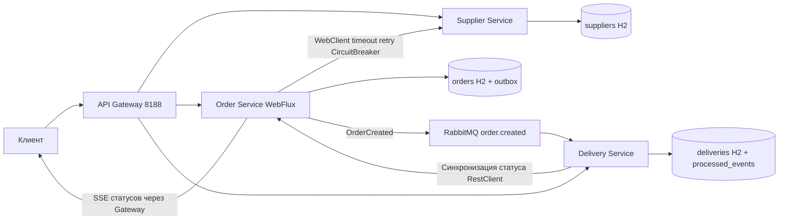
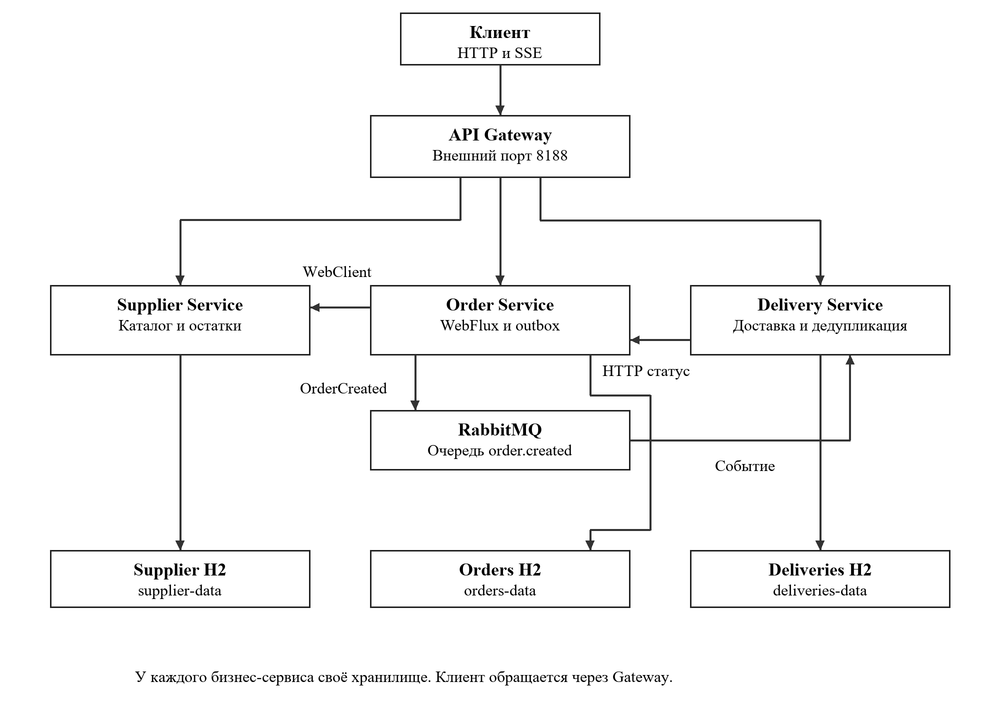

# Практическая работа №8

Итоговая система поставок заказов и доставки

Кашпирев Михаил Дмитриевич

Группа ИКБО-11-23

Связь с курсом: **Завершение курса BootcampLabs**.


## Архитектура



Три бизнес-сервиса — самостоятельные приложения. API Gateway — четвёртое приложение на WebFlux, направляет запросы по `/api/suppliers`, `/api/orders`, `/api/deliveries`. Наружу опубликован только порт Gateway 8188. Traefik здесь не обязателен; инфраструктурная балансировка отдельно демонстрируется в №5.

Каждый сервис имеет собственную файловую H2 в отдельном Docker volume. Сервисы не подключаются к чужим БД. Broker также использует собственный volume. Переменные окружения содержат адреса и параметры подключения.

| Требование | Реализация |
|---|---|
| Синхронный вызов | Order → Supplier через WebClient; получение цены и проверка остатка |
| Событие | OrderCreated через RabbitMQ в Delivery |
| Надёжная публикация | Заказ и outbox в одной транзакции; scheduler повторяет неотправленные записи |
| Идемпотентность | processed_events.event_id PK и deliveries.order_id PK; оба изменения в транзакции |
| Timeout | 2 s для запроса Supplier |
| Retry | Одна повторная попытка только для сетевых ошибок, timeout и 5xx |
| Circuit Breaker | Resilience4j; окно 4, минимум 2, порог 50%, open 5 s |
| Ошибка поставщика | Ограниченное ожидание и HTTP 503 |
| Healthcheck | Actuator всех приложений; RabbitMQ ping |
| Корреляция | X-Request-ID из Gateway → HTTP → outbox → сообщение → Delivery → Order; явные строки в логах |
| Реактивный сценарий | Order WebFlux и `/api/orders/{id}/events` SSE |
| Контейнеры | Единый compose.yaml, старт без ручного запуска приложений |
| Состояния | CREATED → DELIVERY_CREATED → IN_TRANSIT → DELIVERED |

JDBC и RabbitTemplate — блокирующие библиотеки. В Order HTTP-сценарии они выполняются через Mono.fromCallable + boundedElastic, вне event loop; вызов Supplier остаётся реактивным. Самостоятельные фоновые задачи outbox работают в scheduler Spring. Здесь не заявляется полностью неблокирующий доступ к БД.

Статусы доставки синхронизируются с Order в фоне и повторяются после отказа; успешное обновление помечается в локальной БД. Повторный OrderCreated не создаёт вторую доставку. Между записью заказа и доставкой допускается небольшая задержка — eventual consistency.

```powershell
docker compose up --build
# Полная демонстрация, включая остановку Supplier:
.\demo.ps1
```

Демо создаёт заказ с уникальным requestId, открывает SSE, ожидает доставку, переводит её в IN_TRANSIT/DELIVERED, выводит логи по одному ID и сведения о очереди RabbitMQ. Затем останавливает Supplier, выполняет ограниченные по времени запросы, возвращает сервис в finally, ждёт выхода Circuit Breaker и создаёт заказ повторно.

Демо-пароль local-demo-1123 предназначен для локальной изолированной учебной сети; BROKER_PASSWORD может быть задан через окружение. Broker не публикуется наружу.

Все приложения собраны и пять контейнеров healthy. Фактически проверены полный сценарий создания заказа и доставки, RabbitMQ, SSE, единый requestId, остановка Supplier с ограниченным ожиданием и восстановление. run.log содержит полный вывод; idempotence.log — повторную публикацию того же eventId, при которой количество доставок не изменилось. Оригинальные скриншоты находятся в screenshots. Publisher confirms не реализованы: outbox снижает риск рассогласования, но не гарантирует отсутствие потерь при любом отказе брокера.

Собственный репозиторий с исходным кодом: https://github.com/MikhailBOBR/PiRKSP_2_Kashpirev/tree/main/practice-08-microservices. Схема архитектуры приведена выше; полный сценарий и реальные протоколы находятся в этой папке.


## BootcampLabs


Обязательные задания соответствующего модуля зачтены; общий прогресс курса 100%. Необязательные вводные задания на странице модуля могут оставаться «Не начато».

## Сборка образов

Основные Dockerfile используют готовые `target/app.jar`, приложенные к проекту. Для запуска через Compose достаточно Docker Desktop. Исходники и pom.xml сохранены; для пересборки нужен JDK 21 и Maven 3.9: `mvn package` в каждом каталоге сервиса. Dockerfile.source также содержит вариант полной сборки из исходников в контейнере.

## Подробный разбор реализации

Отчёт редакции v1.1 содержит 28 страниц: [открыть DOCX](Практика_08_Кашпирев_МД.docx). [Проверка требований](../Проверка_заданий.md).

### Архитектура и владение данными

Микросервисная система разделяет не только исходные классы, но и ответственность за данные и бизнес-операции. Supplier Service отвечает за каталог и остаток товара, Order Service — за создание и состояния заказа, Delivery Service — за доставку. Каждый компонент является отдельным Spring Boot-приложением с собственным образом и томом хранения. API Gateway предоставляет единую внешнюю точку входа.

Владение данными означает, что Order Service не читает таблицу products напрямую, а запрашивает Supplier через HTTP. Delivery Service получает событие заказа, не выполняя SELECT в чужой базе. Идентификатор другого сервиса может храниться как ссылка, но внешний ключ через разные базы не создаётся. Согласованность обеспечивается сообщениями и API, а не общей транзакцией всех хранилищ.

Для учебного проекта выбраны три файловые базы H2 вместо общего PostgreSQL. Это сокращает число инфраструктурных контейнеров и сохраняет требуемую изоляцию: supplier-data, orders-data и deliveries-data являются отдельными томами. Пять работающих контейнеров не означают пять бизнес-сервисов: бизнес-компонентов три, остальные — Gateway и брокер.

### Синхронные вызовы и события

При синхронном HTTP-вызове Order ожидает информацию о товаре до создания заказа. Это необходимо для проверки количества и расчёта суммы. Асинхронный OrderCreated решает другую задачу: уведомляет Delivery о уже сохранённом заказе. Получателю не требуется быть готовым в момент пользовательского запроса, если событие успешно попало в устойчивую очередь.

RabbitMQ хранит очередь order.created. Producer отправляет сообщение через RabbitTemplate, потребитель обрабатывает его RabbitListener. Событие содержит eventId, orderId, productId, quantity, address и requestId. В него не включается полный каталог или всё состояние заказа: передаются данные, нужные для создания доставки и корреляции.

Событие может прийти повторно, например после сбоя подтверждения обработки. Поэтому создание доставки нельзя считать корректным только потому, что тест с одним сообщением сработал. Потребитель должен отличить новое событие от уже обработанного и не выполнить один бизнес-эффект дважды.

### Outbox и пределы гарантий

Запись заказа в базе и отправка в брокер относятся к разным ресурсам. Если сначала сохранить заказ, а затем процесс завершится до отправки, событие может быть потеряно. Transactional outbox записывает заказ и намерение публикации одной локальной транзакцией. Отдельный плановый обработчик читает неподтверждённые записи outbox и пытается отправить сообщения.

Outbox не устраняет все отказы автоматически. В текущем коде sent=true записывается после convertAndSend без publisher confirms. Между принятием операции клиентской библиотекой и надёжным сохранением брокером остаётся окно неопределённости. Потребитель защищён от дубликатов, но публикация не является доказательством доставки без потерь при любом сбое. Для более сильной гарантии нужны подтверждения брокера и аккуратная политика повторной отправки.

### Ограничение отказов и наблюдаемость

Timeout ограничивает отдельную попытку обращения, retry повторяет подходящий временный сбой, Circuit Breaker прекращает новые обращения к постоянно недоступному сервису. Они решают разные задачи и должны быть согласованы. Нельзя повторять любую ошибку безусловно: отсутствующий товар или неправильное количество не исправятся от немедленного повторения запроса.

X-Request-ID связывает действия нескольких компонентов в одну цепочку. Его передают через HTTP-заголовок и поле события и печатают в журналах. В отличие от eventId, этот идентификатор относится к пользовательскому сценарию и может присутствовать во многих сообщениях. Healthcheck отвечает на другой вопрос — доступен ли компонент сейчас; requestId объясняет прохождение конкретной операции.

### Реактивная часть системы

Order Service и Gateway используют WebFlux. Gateway передаёт поток ответа клиенту, не собирая SSE в один готовый JSON. Order предоставляет Mono одиночного заказа и Flux событий состояния. Для обмена с Supplier применяется WebClient. Supplier и Delivery используют Spring MVC с JDBC; разные модели выполнения допустимы при сохранении корректных границ.

JdbcTemplate является блокирующим. В Order запросы к базе обёрнуты в Mono.fromCallable и вынесены на Schedulers.boundedElastic. Это освобождает event loop от ожидания JDBC, но не превращает драйвер H2 в реактивный. В отчёте реализация описывается как WebFlux с изолированными блокирующими операциями, а не как полностью неблокирующий путь к базе.

### Сервисы хранилища и API Gateway

SupplierApplication предоставляет GET /api/suppliers и GET /api/suppliers/products/{id}. Таблица products хранит ID, SUPPLIER_ID, NAME, PRICE и QUANTITY. Начальный SSD 1TB имеет цену 7900 и остаток 8, Monitor 27 — цену 21900 и остаток 4. При отсутствии товара Supplier возвращает 404.

OrderApplication предоставляет список, создание, чтение, изменение состояния и поток /api/orders/{id}/events. Таблица orders хранит UUID заказа, товар, количество, адрес, сумму, статус, request_id и created_at. В той же базе outbox содержит поля события и признак sent. DeliveryApplication хранит deliveries и processed_events в собственной H2. Уникальность order_id и event_id ограничивает повторные бизнес-эффекты.

Gateway маршрутизирует /api/{service}/** по словарю suppliers, orders и deliveries. Базовые адреса приходят из окружения. Он передаёт метод, тело, параметры запроса, Content-Type, Accept и X-Request-ID; код ответа и поток байтов возвращаются внешнему клиенту. Только Gateway публикует 127.0.0.1:8188. Внутренние API и RabbitMQ не имеют внешнего порта в Compose.

Отдельный Traefik в итоговой практике не добавлен: условие разрешает его повторное использование, но не делает обязательным. Роль единой точки входа выполняет API Gateway. Его реализация собственная на WebFlux, без заявления об использовании Spring Cloud Gateway, которого нет в pom.xml.

### Создание заказа и синхронный WebClient

POST /api/orders принимает productId, quantity и address. Положительность идентификатора и количества и непустой адрес проверяются до запроса Supplier. WebClient вызывает /api/suppliers/products/{id} с тем же X-Request-ID. Если QUANTITY меньше запрошенного, Order отвечает 409 Insufficient stock. Сумма рассчитывается BigDecimal как PRICE × quantity.

Успешная проверка создаёт два UUID: orderId для бизнес-объекта и eventId для сообщения. TransactionTemplate сохраняет orders и outbox одной транзакцией. Это означает, что сбой INSERT outbox откатывает и заказ. Ответ POST с 201 подтверждает локальное создание, а не мгновенное завершение доставки.

Каталог в учебном сценарии используется для проверки наличия. Резервирование и уменьшение остатка Supplier не реализованы. Поэтому повторные заказы не моделируют полноценное складское списание. Для выполнения задания достаточно проверки доступности; при расширении предметной области потребуется отдельный контракт резерва и компенсации.

### Публикация и обработка OrderCreated

publishOutbox запускается каждые 750 мс и выбирает записи sent=false. ObjectMapper сериализует OrderEvent. convertAndSend использует стандартный exchange с routing key order.created, затем обновляет sent. При исключении запись остаётся для следующей попытки, обработчик выводит OUTBOX RETRY и прекращает текущий проход.

Delivery принимает JSON и разбирает OrderEvent. В одной транзакции сначала вставляется eventId в processed_events, затем доставка CREATED. Если создание доставки не завершится, отметка обработки тоже откатится. Потребитель не должен пометить событие обработанным до успешного бизнес-действия в отдельной транзакции, иначе повторное получение не смогло бы восстановить пропущенную доставку.

Сообщение не содержит персональных аккаунтов или токенов; address представляет учебный адрес доставки, requestId — диагностический идентификатор. Брокер и приложения запускаются в одной Compose-сети. durable очередь и том broker-data сохраняют инфраструктурные данные, но пределы надёжности publisher уже разобраны отдельно.

### Идемпотентность и повторные события

При повторном eventId ограничение уникальности processed_events вызывает DuplicateKeyException. Вся транзакция обработки откатывается, а listener выводит DUPLICATE ignored. Уникальный order_id дополнительно защищает от второго создания доставки для того же заказа. В текущем обработчике эти ограничения рассматриваются как признак уже выполненного бизнес-эффекта.

Для фактической проверки повторно опубликован тот же eventId c5212757-dfc8-469d-bffd-a15da1d68087. Ответ RabbitMQ routed=true подтверждает попадание сообщения по маршруту. Число доставок до и после равно двум, а число строк для проверяемого order_id равно одной. Лог DUPLICATE ignored подтверждает, что повторное сообщение дошло до потребителя, а не просто не было отправлено.

Идемпотентность в этом сценарии означает отсутствие второй доставки. Она не обещает ровно одну сетевую попытку: повторная доставка сообщения ожидаема и безопасна для данного эффекта. Учебный listener не содержит отдельной политики dead-letter для произвольного повреждённого JSON, поэтому такая обработка ошибок не включается в перечень выполненных проверок.

### Синхронизация статуса и SSE

Delivery меняет CREATED → IN_TRANSIT → DELIVERED. При каждом изменении synced=false помечает необходимость обновить Order. Плановый syncStatuses вызывает HTTP PUT /api/orders/{id}/status с тем же requestId. Создание доставки отображается на стороне заказа как DELIVERY_CREATED. После успешного ответа строка отмечается synced=true только при совпадении ещё текущего статуса.

Order разрешает CREATED → DELIVERY_CREATED → IN_TRANSIT → DELIVERED. Повтор того же состояния возвращает текущий объект, недопустимый переход — 409. UPDATE выполняется с условием прежнего статуса, поэтому конкурирующая замена обнаруживается. Если Order временно недоступен, синхронизация повторяется, а Delivery сохраняет свою запись.

SSE реализован опросом состояния заказа каждые 350 мс и distinctUntilChanged по STATUS. Он передаёт изменения реальной базы, а не заранее заданный список. При очень быстрых переходах между двумя чтениями промежуточный статус может не попасть в поток. В проверенном сценарии паузы позволили получить все четыре состояния; это не равнозначно долговременному журналу каждого события.

### Timeout retry и Circuit Breaker

Для WebClient Supplier задан timeout 2 секунды. Retry.backoff допускает одну повторную попытку с базовой задержкой 150 мс для сетевых ошибок, таймаута и HTTP 5xx. Ошибка 404 не повторяется и переводится в Product not found. Проверка количества выполняется после получения объекта и не относится к повтору HTTP-запроса.

Circuit Breaker использует окно четырёх вызовов, минимум два результата, порог ошибок 50 процентов, открытое состояние пять секунд и одну пробную попытку HALF_OPEN. Он охватывает цепочку с retry, поэтому одна операция может потратить время двух попыток. Gateway ограничивает обычный запрос семью секундами; для SSE допускает длительное соединение до одного часа.

Если Supplier недоступен, Order возвращает 503 Supplier temporarily unavailable; retry later. В сохранённом отказе первая операция заняла 4,344 секунды, последующие — 0,018 и 0,015 секунды. Разница согласуется с обработкой сетевых попыток и быстрым отказом открытой защиты. Восстановление проверено успешным созданием заказа после запуска Supplier и периода ожидания.

### Корреляция через HTTP и RabbitMQ

Gateway принимает идентификатор длиной от 1 до 80 символов из букв, цифр, точки, подчёркивания и дефиса. Если заголовок отсутствует или не подходит, создаётся UUID. Идентификатор устанавливается в ответ и передаётся внутреннему сервису. Такая проверка ограничивает произвольный ввод в журнал, но не является проверкой личности клиента.

При создании Order сохраняет requestId в orders и outbox. Supplier выводит его при поиске товара, publisher включает в OrderEvent, Delivery печатает при потреблении и передаёт обратно Order при синхронизации. Для сценария kashpirev-1123-1791128268 журнал связывает Gateway → Order → Supplier → RabbitMQ → Delivery → Order. eventId остаётся отдельным значением для дедупликации.

Корреляция реализована явным заголовком и полем сообщения. Распределённые span, отдельный tracing-сервер и Micrometer Context Propagation не используются. Возможность проследить конкретный requestId подтверждается приложенным текстом логов нескольких компонентов.

### Compose готовность и воспроизведение

compose.yaml запускает broker, supplier, orders, deliveries и gateway. Брокер проверяется rabbitmq-diagnostics ping, приложения — /actuator/health. Gateway ожидает готовности трёх бизнес-сервисов, Order и Delivery — готовности брокера. Именованные тома отдельны, поэтому тест повторного события не зависит от общей таблицы всех приложений.

Все бизнес-компоненты запускаются через Compose. demo.ps1 обращается только к внешнему Gateway, подписывается на SSE, создаёт заказ, ожидает доставку, меняет состояния, получает логи корреляции, останавливает и восстанавливает Supplier. Вмешательство в другие проекты Docker не требуется. Первый запуск может включать скачивание образов; готовые app.jar приложены для каждого Java-приложения.

### Проверенные сценарии

| Проверка | Данные | Результат |
|---|---|---|
| Создание заказа | productId 1; quantity 2 | TOTAL 15 800; CREATED |
| Передача события | order.created; eventId c521… | PUBLISHED → CONSUMED |
| Создание доставки | orderId b73d… | Одна связанная доставка CREATED |
| Реактивные обновления | GET /api/orders/{id}/events | CREATED, DELIVERY_CREATED, IN_TRANSIT, DELIVERED |
| Корреляция | kashpirev-1123-1791128268 | Gateway, Supplier, Order, Delivery |
| Повтор события | Тот же eventId; routed=true | before=2; after=2; matching=1 |
| Отказ Supplier | Три попытки POST | 503; 4,344 / 0,018 / 0,015 с |
| Восстановление | Supplier снова запущен | Новый заказ TOTAL 7900 |
| Готовность | Compose ps | Все пять healthy |

### Разбор результатов

Сквозной заказ b73d13eb-6acd-4646-86cf-66d483bfe570 создан 4 октября 2026 года на сумму 15 800 = 7900 × 2. Его событие c5212757-dfc8-469d-bffd-a15da1d68087 породило доставку с тем же order_id и request_id. Изменения доставки затем отразились в SSE заказа. Таким образом, отдельные технологии соединены одним бизнес-объектом, а не показаны независимыми несвязанными примерами.

Отдельный idempotence.log содержит исход повторной публикации. Количество доставок два объясняется также заказом проверки восстановления; для исходного заказа matching order_id rows=1. Сравнение только общего числа без связи с конкретным заказом было бы слабее: оно не показывало бы, какая доставка проверялась. В отчёте приведены оба измерения.

После остановки Supplier API не зависает бесконечно и не возвращает необработанный Java stack trace как нормальный результат. Получены контролируемые 503 и измеренное время ожидания. После восстановления создан заказ d743ad0d-1f7e-4f3a-9249-4c8e2100c80f с суммой 7900. Эти данные показывают и отказ, и возвращение к работе.

Пустая очередь после завершения сценария означает отсутствие ожидающих сообщений в момент проверки. Она сама по себе не доказывает успешное выполнение потребителя; для этого используются CONSUMED, созданная доставка и её статус. Аналогично healthy показывает текущую доступность, а не гарантию бизнес-корректности при любом отказе.

### Ограничения

Учебная система не резервирует остатки, не аутентифицирует клиентов и не реализует publisher confirms или полноценный журнал SSE. H2 с JDBC требует boundedElastic в Order. Доставка допускает краткую рассогласованность статусов во время плановой синхронизации. Эти ограничения не препятствуют выполнению заданного локального сценария, но ограничивают перенос реализации в эксплуатацию.

## Схема и описание архитектуры



[Подробное описание](ARCHITECTURE.md).
