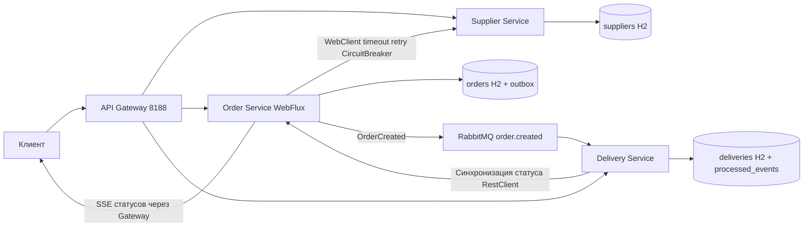

# Практическая работа №8

Итоговая система поставок заказов и доставки

Кашпирев Михаил Дмитриевич

Группа ИКБО-11-23

Связь с курсом: **Завершение курса BootcampLabs**.


## Архитектура



Три бизнес-сервиса — самостоятельные приложения. API Gateway — четвёртое приложение на WebFlux, направляет запросы по `/api/suppliers`, `/api/orders`, `/api/deliveries`. Наружу опубликован только порт Gateway 8188. Traefik здесь не обязателен; инфраструктурная балансировка отдельно демонстрируется в №5.

Каждый сервис имеет собственную файловую H2 в отдельном Docker volume. Сервисы не подключаются к чужим БД. Broker также использует собственный volume. Переменные окружения содержат адреса и параметры подключения.

| Требование | Реализация |
|---|---|
| Синхронный вызов | Order → Supplier через WebClient; получение цены и проверка остатка |
| Событие | OrderCreated через RabbitMQ в Delivery |
| Надёжная публикация | Заказ и outbox в одной транзакции; scheduler повторяет неотправленные записи |
| Идемпотентность | processed_events.event_id PK и deliveries.order_id PK; оба изменения в транзакции |
| Timeout | 2 s для запроса Supplier |
| Retry | Одна повторная попытка только для сетевых ошибок, timeout и 5xx |
| Circuit Breaker | Resilience4j; окно 4, минимум 2, порог 50%, open 5 s |
| Ошибка поставщика | Ограниченное ожидание и HTTP 503 |
| Healthcheck | Actuator всех приложений; RabbitMQ ping |
| Корреляция | X-Request-ID из Gateway → HTTP → outbox → сообщение → Delivery → Order; явные строки в логах |
| Реактивный сценарий | Order WebFlux и `/api/orders/{id}/events` SSE |
| Контейнеры | Единый compose.yaml, старт без ручного запуска приложений |
| Состояния | CREATED → DELIVERY_CREATED → IN_TRANSIT → DELIVERED |

JDBC и RabbitTemplate — блокирующие библиотеки. В Order HTTP-сценарии они выполняются через Mono.fromCallable + boundedElastic, вне event loop; вызов Supplier остаётся реактивным. Самостоятельные фоновые задачи outbox работают в scheduler Spring. Здесь не заявляется полностью неблокирующий доступ к БД.

Статусы доставки синхронизируются с Order в фоне и повторяются после отказа; успешное обновление помечается в локальной БД. Повторный OrderCreated не создаёт вторую доставку. Между записью заказа и доставкой допускается небольшая задержка — eventual consistency.

```powershell
docker compose up --build
# Полная демонстрация, включая остановку Supplier:
.\demo.ps1
```

Демо создаёт заказ с уникальным requestId, открывает SSE, ожидает доставку, переводит её в IN_TRANSIT/DELIVERED, выводит логи по одному ID и сведения о очереди RabbitMQ. Затем останавливает Supplier, выполняет ограниченные по времени запросы, возвращает сервис в finally, ждёт выхода Circuit Breaker и создаёт заказ повторно.

Демо-пароль local-demo-1123 предназначен для локальной изолированной учебной сети; BROKER_PASSWORD может быть задан через окружение. Broker не публикуется наружу.

Все приложения собраны и пять контейнеров healthy. Фактически проверены полный сценарий создания заказа и доставки, RabbitMQ, SSE, единый requestId, остановка Supplier с ограниченным ожиданием и восстановление. run.log содержит полный вывод; idempotence.log — повторную публикацию того же eventId, при которой количество доставок не изменилось. Оригинальные скриншоты находятся в screenshots. Publisher confirms не реализованы: outbox снижает риск рассогласования, но не гарантирует отсутствие потерь при любом отказе брокера.

Собственный репозиторий с исходным кодом: https://github.com/MikhailBOBR/PiRKSP_2_Kashpirev/tree/main/practice-08-microservices. Схема архитектуры приведена выше; полный сценарий и реальные протоколы находятся в этой папке.


## BootcampLabs


Обязательные задания соответствующего модуля зачтены; общий прогресс курса 100%. Необязательные вводные задания на странице модуля могут оставаться «Не начато».

## Сборка образов

Основные Dockerfile используют готовые `target/app.jar`, приложенные к проекту. Для запуска через Compose достаточно Docker Desktop. Исходники и pom.xml сохранены; для пересборки нужен JDK 21 и Maven 3.9: `mvn package` в каждом каталоге сервиса. Dockerfile.source также содержит вариант полной сборки из исходников в контейнере.
